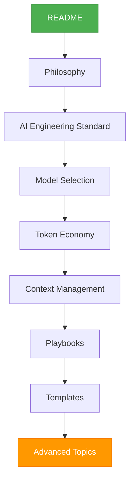

# Learning Path

> A step-by-step reading roadmap designed to guide you through the AI Engineering Playbook, building from foundational concepts to advanced production execution.

---

## Path Overview

---

## 1. Entry Point: README
*   **Location:** [README.md](README.md)
*   **Purpose:** Establishes the repository's mission, core principles, target audience, and layout.
*   **What you learn:** The vision of the playbook and how to navigate the folders.
*   **Estimated reading time:** 3 mins

## 2. Core Philosophy
*   **Location:** [README.md#core-philosophy](README.md#core-philosophy) & [standards/AI_ENGINEERING_STANDARD.md#2-operating-philosophy](standards/AI_ENGINEERING_STANDARD.md#2-operating-philosophy)
*   **Purpose:** Lays out the operational trade-offs (`Revenue > Perfection`, `Security > Speed`, `Stability > Elegance`).
*   **What you learn:** The mindset of value-driven, disciplined engineering with AI.
*   **Estimated reading time:** 5 mins

## 3. The Baseline: AI Engineering Standard
*   **Location:** [standards/AI_ENGINEERING_STANDARD.md](standards/AI_ENGINEERING_STANDARD.md)
*   **Purpose:** The central rulebook for all AI-assisted tasks.
*   **What you learn:** Task size classification (Tiny, Small, Medium, Large, Critical), guidelines for refactoring, editing rules, and stopping thresholds.
*   **Estimated reading time:** 12 mins

## 4. Routing Decisions: Model Selection
*   **Location:** [standards/MODEL_SELECTION.md](standards/MODEL_SELECTION.md)
*   **Purpose:** Framework for choosing the lowest-cost model appropriate for a task.
*   **What you learn:** The capability tier model (Small/Mini, Medium, High, Extra-High), routing table for specific tasks, and rules for escalating to larger models.
*   **Estimated reading time:** 6 mins

## 5. Cost Efficiency: Token Economy
*   **Location:** [standards/TOKEN_ECONOMY.md](standards/TOKEN_ECONOMY.md)
*   **Purpose:** Rules and budgets to control runaway token consumption.
*   **What you learn:** The core sources of token waste, hard budgets for file reads and subagents, and guidelines for good/bad token behaviors.
*   **Estimated reading time:** 8 mins

## 6. Context Control: Context Management
*   **Location:** [standards/CONTEXT_MANAGEMENT.md](standards/CONTEXT_MANAGEMENT.md)
*   **Purpose:** Keeping the working context small to prevent model confusion and errors.
*   **What you learn:** Priority order for reading files, context budget tables, and the working summary template.
*   **Estimated reading time:** 8 mins

## 7. Execution: Playbooks
*   **Location:** [playbooks/README.md](playbooks/README.md)
*   **Purpose:** Step-by-step instructions for specific engineering tasks.
*   **What you learn:** How to build features ([FEATURE.md](playbooks/FEATURE.md)), fix bugs ([BUG_FIX.md](playbooks/BUG_FIX.md)), run launches ([LAUNCH_MODE.md](playbooks/LAUNCH_MODE.md)), release code ([RELEASE.md](playbooks/RELEASE.md)), and respond to live issues ([HOTFIX.md](playbooks/HOTFIX.md) and [INCIDENT.md](playbooks/INCIDENT.md)).
*   **Estimated reading time:** 20 mins (selectively by task type)

## 8. Guardrails: Checklists & Templates
*   **Locations:** [checklists/README.md](checklists/README.md) & [templates/README.md](templates/README.md)
*   **Purpose:** Reusable documents and verification steps to run before committing or deploying.
*   **What you learn:** Pre-PR review criteria ([PRE_PR.md](checklists/PRE_PR.md)), agent prompt files, and PR templates.
*   **Estimated reading time:** 10 mins

## 9. Advanced Topics & Strategy
*   **Locations:** [reference/README.md](reference/README.md), [rfcs/README.md](rfcs/README.md), [metrics/README.md](metrics/README.md)
*   **Purpose:** High-level patterns, company-wide metrics, and long-term operating models.
*   **What you learn:** How to measure AI ROI ([AI_ROI.md](metrics/AI_ROI.md)), subagent guidelines, patterns for solo developers and companies, and architectural decision trees.
*   **Estimated reading time:** 15 mins
