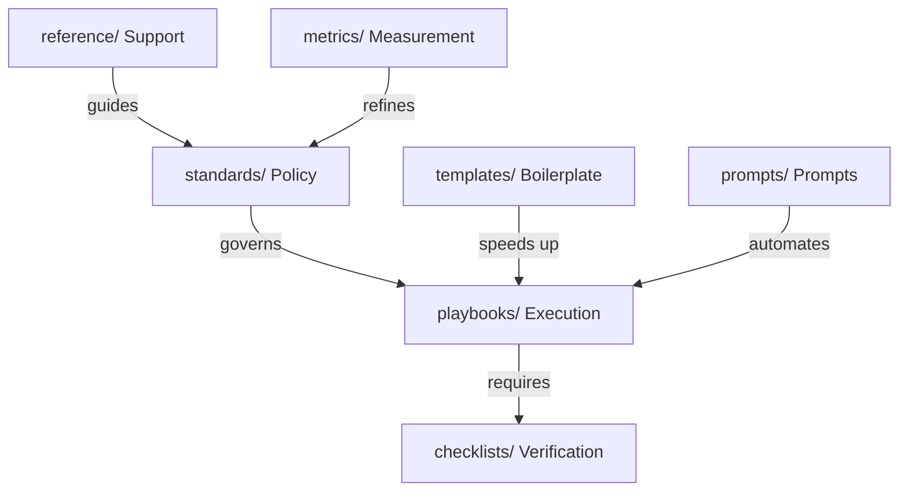

# Repository Map

> Visual layout and folder responsibilities of the AI Engineering Playbook repository.

---

## 1. Repository Structure

```text
.
├── .github/                   # GitHub configuration & Issue templates
├── standards/                 # Core rules, limits, and standards
├── playbooks/                 # Step-by-step operational workflows
├── checklists/                # Verification checklists (pre-commit, release, etc.)
├── templates/                 # Reusable starting points (PRs, ADRs, issue bodies)
├── prompts/                   # Production-oriented prompt patterns
├── reference/                 # Glossary, comparisons, decision trees
├── case-studies/              # Contextual setups (solo devs, startups, agencies)
├── metrics/                   # Measurement frameworks (ROI, token efficiency)
└── rfcs/                      # Proposed changes and architectural designs
```

---

## 2. Directory Responsibilities

### [standards/](standards/)
*   **Role:** Governance and Policy.
*   **Content:** Stable rules defining what is allowed and expected.
*   **Key Files:** [standards/AI_ENGINEERING_STANDARD.md](standards/AI_ENGINEERING_STANDARD.md), [standards/MODEL_SELECTION.md](standards/MODEL_SELECTION.md).

### [playbooks/](playbooks/)
*   **Role:** Operations and Workflows.
*   **Content:** Procedural execution steps for tasks.
*   **Key Files:** [playbooks/FEATURE.md](playbooks/FEATURE.md), [playbooks/BUG_FIX.md](playbooks/BUG_FIX.md).

### [checklists/](checklists/)
*   **Role:** Quality Gate and Verification.
*   **Content:** Lightweight, actionable verification steps.
*   **Key Files:** [checklists/PRE_PR.md](checklists/PRE_PR.md), [checklists/PRODUCTION.md](checklists/PRODUCTION.md).

### [templates/](templates/)
*   **Role:** Boilerplate and Speed.
*   **Content:** Reusable layouts to maintain consistency.
*   **Key Files:** [templates/PULL_REQUEST_TEMPLATE.md](templates/PULL_REQUEST_TEMPLATE.md), [templates/ADR.md](templates/ADR.md).

### [prompts/](prompts/)
*   **Role:** Prompt Engineering & Automation.
*   **Content:** Bounded prompts for specific developer or review actions.
*   **Key Files:** [prompts/IMPLEMENTATION.md](prompts/IMPLEMENTATION.md), [prompts/LAUNCH_GATE.md](prompts/LAUNCH_GATE.md).

### [reference/](reference/)
*   **Role:** Support and Context.
*   **Content:** Theoretical models, comparison tables, and decisions.
*   **Key Files:** [reference/DECISION_TREE.md](reference/DECISION_TREE.md), [reference/GLOSSARY.md](reference/GLOSSARY.md).

### [case-studies/](case-studies/)
*   **Role:** Adaptability and Context.
*   **Content:** Real-world playbook configurations based on team size.
*   **Key Files:** [case-studies/SOLO_DEVELOPER.md](case-studies/SOLO_DEVELOPER.md).

### [metrics/](metrics/)
*   **Role:** Analytics and Review.
*   **Content:** Frameworks to measure AI tool ROI and developer efficiency.
*   **Key Files:** [metrics/AI_ROI.md](metrics/AI_ROI.md).

---

## 3. Relationships Between Components


