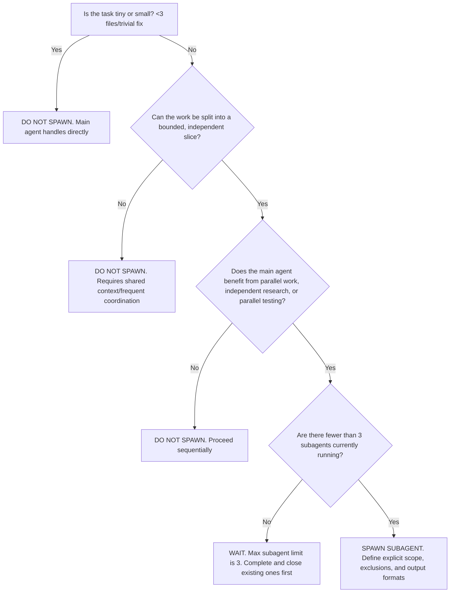
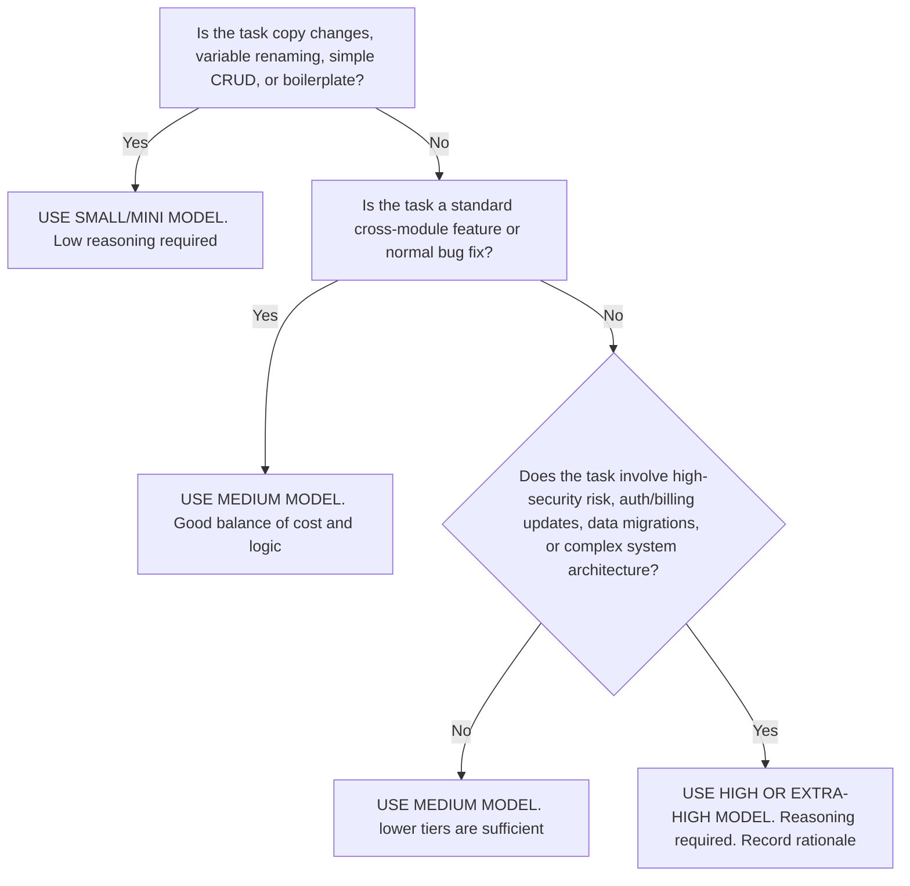
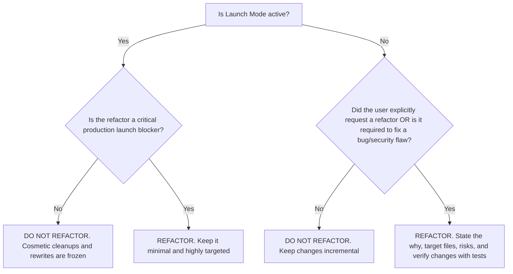
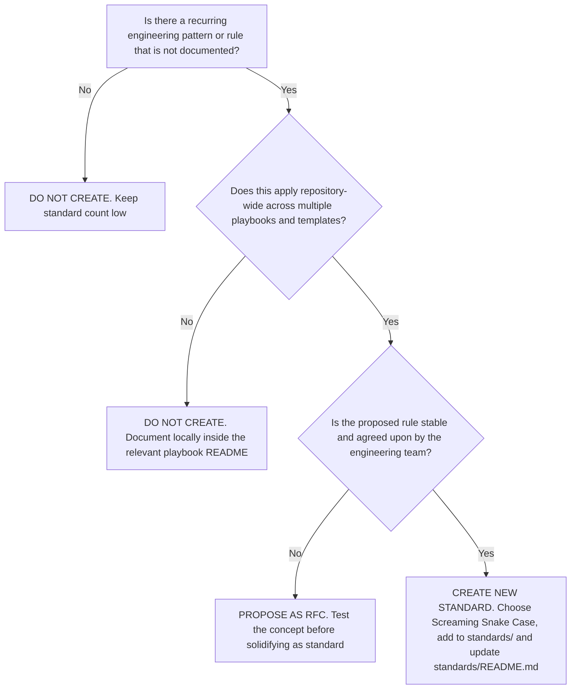
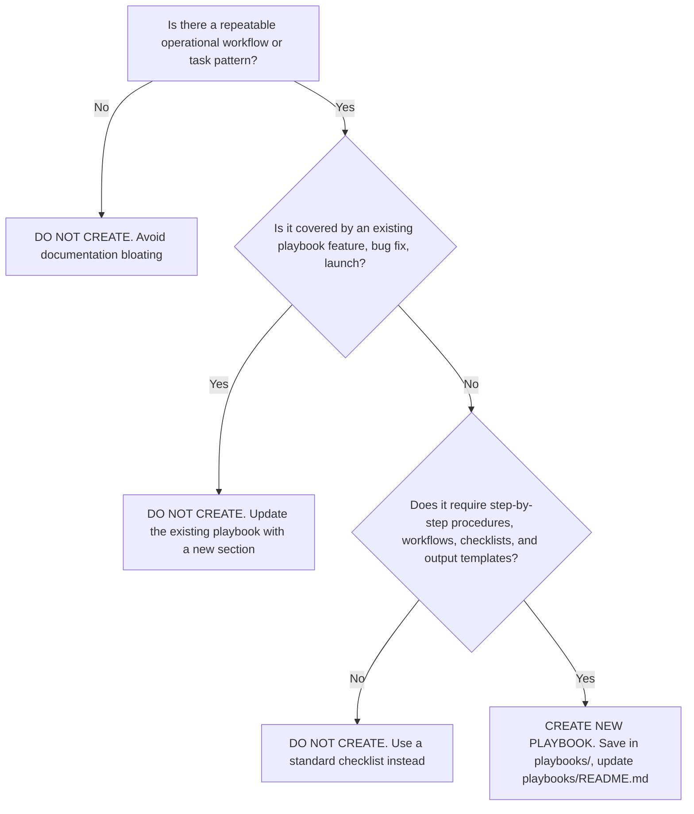

# Decision Trees

Use these decision trees as operational guides when navigating AI-assisted software development tasks, model routing choices, refactoring requests, and standard expansions.

---

## 1. Should I Spawn a Subagent?

---

## 2. Should I Use a Larger Model?

---

## 3. Should I Refactor?

---

## 4. Should I Create a New Standard?

---

## 5. Should I Create a New Playbook?

