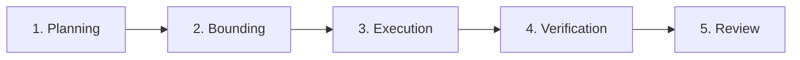

# AI Engineering Standard

> The central operating standard for AI-assisted software development in this repository. All contributors (both human developers and AI agents) must adhere to these rules.

---

## 1. Core Principle & Purpose

AI agents are engineering tools, not a replacement for human engineering responsibility. Every agent action has a cost (token cost, time cost, review cost, context cost, and production risk cost).

Optimize for:
> **Production-grade output per token**

not:
> **Maximum output per request**

---

## 2. Operating Philosophy

Ensure your work aligns with these priority trade-offs:

```text
Revenue > Perfection  — Focus on delivering active client and business value.
Stability > Elegance  — Prefer simple, readable patterns over complex refactoring.
Security > Speed     — Never bypass safety or validation checks for speed.
Small Diffs > Large   — Keep changes highly targeted and easy to review.
Verification > Belief — Trust no generated output without concrete verification.
```

---

## 3. Human Ownership & Accountability

The human developer (or main orchestrating agent) keeps sole responsibility for:
- Bounding the task scope.
- Approving architectural changes.
- Validating security-sensitive implementations.
- Executing git commits and releases.
- Accepting production risks.

Subagents and coding assistants may propose modifications or investigate bugs, but they do not own the final integration decision.

---

## 4. Phase-by-Phase Developer Lifecycle

AI-assisted engineering tasks must follow these five disciplined phases:



### Phase 1: Planning
1.  **Define the Goal:** Clarify the exact feature requirements or bug reproduction steps before opening files.
2.  **Determine Constraints:** Identify tech stack, dependency limits, security boundaries, and database schema constraints.
3.  **Draft a Path:** List the files that must be modified and the test cases that must pass.

### Phase 2: Bounding (Context Control)
1.  **Target Files:** Load only files directly related to the task.
2.  **Verify Budgets:** Ensure you do not exceed your file read or subagent budgets (see Section 6).
3.  **Establish a Summary:** Keep a running working summary to prevent context memory loss over long sessions.

### Phase 3: Execution (Coding)
1.  **Smallest Diff:** Implement the smallest change that fully satisfies the requirements.
2.  **Style Alignment:** Follow the project's existing coding conventions (naming, error handling, folder structure). Do not introduce cosmetic style changes.
3.  **No Unrelated Edits:** Never modify unrelated files or clean up nearby code "while you are here" unless explicitly requested.

### Phase 4: Verification (Testing Ladder)
1.  **Follow the Ladder:** Validate code changes step-by-step using the testing ladder (see Section 7).
2.  **Evidence Collection:** Document test logs, build outcomes, and smoke test outputs.
3.  **Handle Failures:** Stop and reassess if a test fails twice. Do not repeat failed commands in a loop.

### Phase 5: Review
1.  **Diff Review:** Run a git diff check before staging files to review every line changed.
2.  **Safety Checklist:** Confirm that no credentials, public endpoints, rate limits, or authorization checks are broken.
3.  **Draft Summaries:** Output structured change reports containing verification evidence and potential risks.

---

## 5. Task Classification

Every task must be classified before work begins to establish cost and context boundaries:

| Task Size | Description | Examples | Max Subagents | File Read Limit |
|---|---|---|---:|---:|
| **Tiny** | Trivial configs, imports, typos | Renaming a variable, adding a missing import, changing a config value | 0 | 3 files |
| **Small** | Bounded logic under 3 files | Writing a single component, adding one validation rule, fixing an isolated bug | 0 | 8 files |
| **Medium** | Feature/bug across 2-5 files | Creating an API endpoint with corresponding frontend updates and unit tests | 1 | 20 files |
| **Large** | Multi-module feature or audit | Adding a new service, performing a security review, or optimization task | 2 | 40 files |
| **Critical** | Risk-sensitive system redesigns | Migrating databases, authentication changes, fixing core payment/billing logic | 3 | 60 files |

---

## 6. Budget & Resource Limits

To control API expenditures and prevent context bloat, abide by these hard ceilings:

-   **Model Routing:** Always use the lowest-capability model tier (e.g., Small/Mini) that can resolve the task. Reserved Extra-High Reasoning models *only* for planning, security architecture, and complex cross-module bug investigations.
-   **Escalation Rule:** Before switching to an Extra-High Reasoning model, you must state why the Medium model is insufficient.
-   **Subagent Limit:** Never spawn more than 3 subagents concurrently. Close subagents immediately once their task is complete.

---

## 7. The Testing & Verification Ladder

Verification must progress from lightweight checks to full system builds:

1.  **Static Reasoning:** Walk through the code logic manually to find edge cases.
2.  **Static Analysis:** Run the linter and compiler/typecheck on modified files.
3.  **Targeted Tests:** Run specific unit tests targeting the modified class/function.
4.  **Integration Tests:** Execute integration suites for the affected modules.
5.  **Full Test Suite:** Run the complete project test suite to verify no regressions.
6.  **Build Verification:** Run the production build locally to ensure bundling succeeds.
7.  **Manual Smoke Check:** Run the service locally and visually test the primary user flow.

---

## 8. Stop & Escalation Rules

Stop work, summarize your findings, and ask for human clarification immediately if:
-   **Scope Expansion:** The task requires editing more than 8 unrelated files.
-   **Failed Attempts:** Two consecutive implementation paths or bug fixes fail.
-   **Architecture Churn:** You discover that a database schema or major API interface must change to complete the task.
-   **Destructive Risk:** A database migration risks data loss or tables locks.
-   **Ambiguous Requirements:** The user's request contradicts existing standards or contains logical conflicts.
-   **Production Risk:** You are unsure of the rollback plan or deployment impact.

---

## 9. Required Output Formats

Ensure your final task responses use these markdown templates:

### For Implementation Work
```markdown
### Summary
[Brief description of the changes and what they accomplish]

### Files Changed
- [File Name 1](file:///absolute/path/to/file1)
- [File Name 2](file:///absolute/path/to/file2)

### Verification
[Output logs of tests run, build checks, or smoke test results]

### Risks & Mitigations
[Highlight security, performance, or rollback risks]

### Next Step
[E.g., staging deploy, schema migration execution, human review]
```

### For Investigation & Bug Hunting
```markdown
### Summary of Findings
[Overview of the bug behavior]

### Evidence & Reproduction
[Log snippets, tracebacks, or steps to reproduce]

### Root Cause
[Why the issue occurred]

### Options
1. [Option A - pros/cons]
2. [Option B - pros/cons]

### Recommended Solution
[Specific patch proposal and reasoning]
```

### For Code & Security Reviews
```markdown
### Verdict
[PASS / PASS WITH NOTES / BLOCKED]

### Blockers (Critical/High Severity)
- [File Name](file://path/to/file#L12) - [Description of vulnerability or bug]

### Suggestions (Medium/Low Severity)
- [Description of refactoring, optimization, or logging suggestion]

### Verification Checklist
[Results of security and functional checklists]

### Rollback Readiness
[Is the change backward-compatible? Can it be safely reverted?]
```

---

## 10. Core Decision Rules

When multiple implementation options are technically sound, always choose based on this hierarchy:

1.  **Safety First:** Select the option with the lowest security and data-loss risk.
2.  **Simplicity Over Elegance:** Avoid creating generic abstractions before there is a repeated need.
3.  **Ease of Verification:** Choose the option that is easiest to test automatically.
4.  **Ease of Rollback:** Prefer backward-compatible designs.
5.  **Ease of Maintenance:** Write code that matches existing codebase patterns.

---

## 11. Common Anti-Patterns to Avoid

-   **Blind Reading:** Loading the entire repository into context before planning.
-   **Chaining by Default:** Spawning subagents for trivial tasks (like typo fixes or single imports).
-   **Cosmetic Churn:** Refactoring code or renaming files while implementing an unrelated feature.
-   **Conversation Loops:** Explaining changes in prose rather than presenting a concrete git patch.
-   **Abusing High Tiers:** Using high-reasoning models for formatting, boilerplate generation, or running terminal commands.
-   **Silencing Risks:** Hiding uncertainty or ignoring failed test logs in progress updates.
